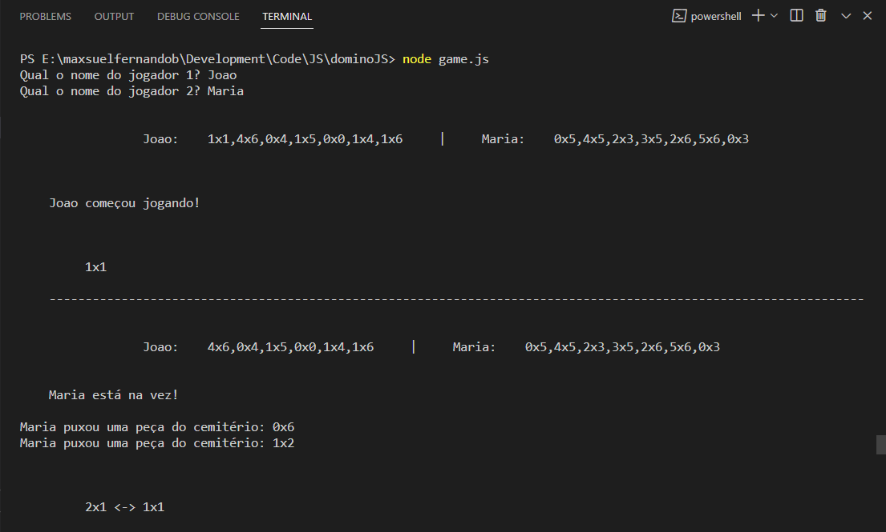
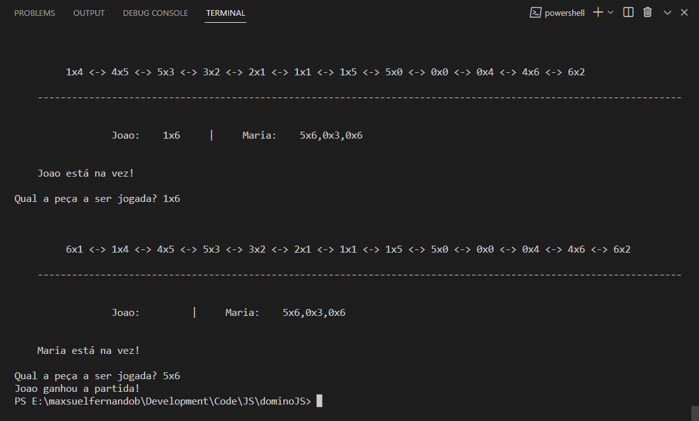

# dominoJS


## Sobre o projeto

dominoJS é um jogo interativo de dominó para dois jogadores, em JavaScript e executado direto do console, utilizando Node e Yarn com a dependência Readline para interface de captura dos nomes dos Jogadores. 

<br>

### Layout Console





<br>

## Tecnologias utilizadas

### Back-End
* NodeJS
* Yarn

### Front-End
* JS

### Dependências
* Readline

<br>

## Como executar o projeto
```bash
# clonar repositório
git clone git@github.com:maxsueldev/dominoJS.git

# instalar o NodeJS

# instalar o Yarn
npm install yarn

# adicionar dependência Readline
npm install readline
```

<br>

## Autor
Maxsuel Santos

<https://www.linkedin.com/in/maxsuelfernandob/>
